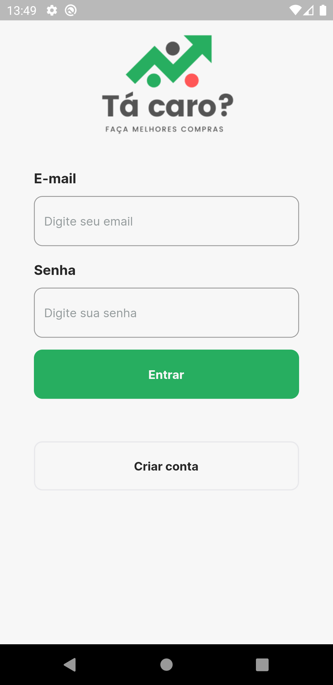
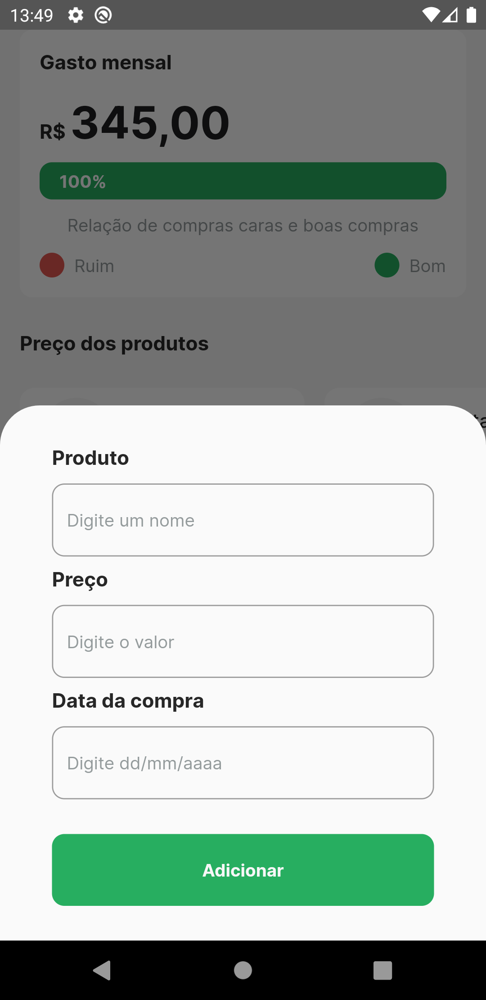

# Tá Caro

Uma rede social de preços, onde os usuários podem cadastrar as compras que fizeram e comparar com a de outros usuários, dessa forma os usuários podem utilizar o Tá Caro para controlar os seus gastos.

## Tecnologias

As seguintes tecnologias e pacotes foram usadas na construção do projeto:

- [Flutter](https://flutter.dev/)
- [Supabase](https://supabase.com/)
- [google_fonts](https://pub.dev/packages/google_fonts)
- [validators](https://pub.dev/packages/validators)
- [supabase](https://pub.dev/packages/supabase)
- [font_awesome_flutter](https://pub.dev/packages/font_awesome_flutter)
- [flutter_multi_formatter](https://pub.dev/packages/flutter_multi_formatter)

## Como Usar

```
 - Clone esse repositório:
 $ git clone https://github.com/lucas-salles/ta-caro.git

 - Entre no diretório:
 $ cd ta-caro

 - Instale as dependências:
 $ flutter pub get

 - Inicie o app: 
 $ flutter run
 ```

<div>
  
   
  
  
</div>
